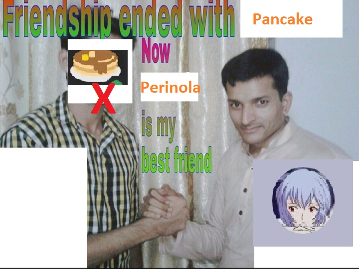

# Perinola BOT 😈🎵🎶




****
**Music bot that plays music from youtube for private server usage made in Python**
****

# Requirements

### To start using the bot first you need to do the following:

- Have Python installed

Install the virtual environment module and install the required version dependencies
```
python -m virtualenv env
```

From the powershell in the root directory of the project use the following command to start the virtual environment module
```
./env/Scripts/activate
```
Now you install the dependencies in the ***requirements.txt*** file by using the following command
```
pip install -r requirements.txt
```

# Usage

To start using the program enter the powershell in the virtual environment and run the following:

```
py src/app.py
```

# To-do ⭕

- ***[Command]*** to move the bot from channels
- ***[Improvement]*** Make the bot move automaticaly from where he is being called
- ***[Feature]*** UI for better User eXperience
